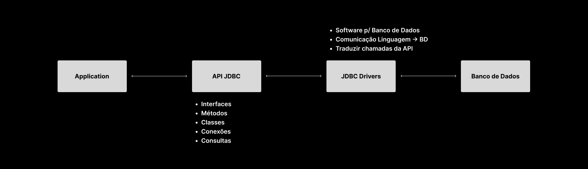
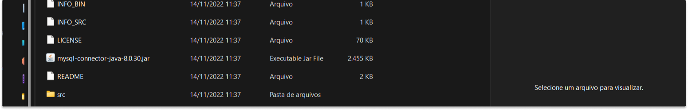

# Java Data Base Connectivity
Ou como é conhecido por JDBC, é um conjunto de Funcionalidades/Interfaces/Classes comuns que ajudam o programador a manipular algum banco de dados relacional de forma mais otimizada. Funciona como uma ponte entre a aplicação Java e o banco de dados em questão, realizando a interpretação e a conversão dos comandos do banco, de acordo com as características de cada um.

Tendo isso em vista, podemos fragmentar o JDBC em duas camadas distintas, a <strong>API JDBC</strong> e os <strong>DRIVERS JDBC</strong>

## JDBC API
Se tratam do conjunto de interfaces e métodos que são fornecidos para o usuário interagir dentro do banco de dados. Estamos tratando de
```
    Métodos
    Classes
    Interfaces
    Conexões com o Banco de Dados
    Consultas
``` 

## JDBC Drivers
Software específico para um determinando banco de dados. É responsável por fornecer a comunicação de dados entre a aplicação Java e o banco de dados, tendo a responsabilidade de traduzir os comandos passados pela API JDBC para comandos e protocolos nativos do banco de dados utizado.
Cada banco de dados requer um driver específico para fazer funcionar.
<hr>

Elaborando uma linha compreensiva de eventos, podemos mapear a interação dessa forma:

<p>
    
</p>

# Preparando o ambiente
Nesse contexto, vamos trabalhar com o MySQL, e como vimos antes, cada banco de dados implica em um Driver diferente, então vamos precisar baixar o driver para incorpora-lo ao nosso projeto.

### Baixando Driver
Você pode encontrar o driver clicando <a href="https://dev.mysql.com/downloads/connector/j/?os=26" rel="external" target="_blank">aqui</a>. Lembre-se de baixar o arquivo com a extensão ".zip" e o extraia assim que baixar.

Após isso, procure o arquivo com extensão .jar, deve ser algo parecido com isso aqui (mysql-connector-java-{número da versão})

<p>
    
</p>

### Adicionando Driver ao Ambiente
Agora vamos incorporar o Driver no seu projeto. Na sua IDE (Estou usando o eclipse de referência) crie uma pasta a parte e a nomeie com a sua preferência. Geralmente uso "libs para questão de leitura"

<p>
    
</p>

Agora adicione o driver que acabamos de baixar dentro dessa pasta criada. Você pode tanto fazer pelo explorador de arquivos dentro do sistema, como você pode copiar e colocar direto para o eclipse.

# Hora de Brincar
Agora vamos, de fato entrar em código e fazer nossas primeiras implementações. Algumas considerações vão ser levantadas ao longo do desenvolvimento, mas vamos citá-las a medida que elas aparecem, para fazer sentido.

### Conectando a Base de Dados
Em primeiro plano, faz sentido pensar que, para conectar a base de dados, precisamos dos parametros para acessá-la, que vão ser a <strong>url</strong>, o <strong>usuário</strong> e a <strong>senha</strong>. Dentro de código, podemos implementar da seguinte forma:

````java
    import java.sql.Exception;
    import java.sql.DriveManager;
    import java.sql.Connection;

    public class Project {
        public static void main(String[] args) {

            try {
                final String url = "jdbc:mysql://localhost:3306/nomeDatabase";
                final String user = "yourUsername";
                final String password = "yourPassword";

                Connection connection = DriveManager.getConnection(url, user, password);

            } catch (SQLException e) {

            }
        }
    }

````
Dessa forma, através dos parâmetros, podemos testar se nossa conexão vai ser bem sucedida. Ao executar, caso não apareça nada ou uma mensagem de <strong>advertência</strong>(E não de erro), quer dizer que funcionou e podemos seguir a diante.

Aqui já começam as primeiras considerações:
<ul>
    <li>Todas as nossas importações serão feitas a partir de "java.sql."
    <li>Todas os métodos de java.sql lançam uma exceção checada, que não é válido saber detalhes, mas isso implica dizer que você deve "tratar" essa exceção, por isso o uso obrigatório do bloco try/catch.
    <li>Sobre a url: "localhost:3306" é o nome do seu servidor local(Criado por padrão ao baixar o mysql), mas se você tiver outro servidor criado e quiser usá-lo, só trocar o nome do servidor na url.
</ul>

### Inserido elementos / Comandos Indiretos (Parâmetros)
Agora vamos inserir dentro da sua base de dados. Aqui eu já vou levar em conta que estamos com a base de dados e tabelas já criadas. Lembre-se que para acessar seu banco, sua conexão deve estar aberta, <strong>então sugiro que a abertura da conexão seja um método a parte</strong>, já que ela sempre vai ser usada.

Mas vamos inserir dados dentro da sua tabela:

````java
    import java.sql.Exception;
    import java.sql.DriveManager;
    import java.sql.Connection;
    import java.sql.PreparedStatement;

    public class Project {
        public static void main(String[] args) {

            try {
                Connection connection = FabricaDeConexao.conectar();

                String comandoSql = "INSERT INTO nomeTabela (coluna1, coluna2) VALUES (?, ?)";
                PrepareStatement stmt = connection.prepareStatement(comandoSql)

                stmt.setString(1, value1);            
                stmt.setString(2, value2);            
                
                stmt.execute();

                connection.close();

            } catch (SQLException e) {

            }
        }
    }

````
Veja que a conexão e os comandos sql serão constantes na implementação, as variáveis dentro do comandoSql agora são substituídas por "?". Mas aqui existem algumas considerações a serem feitas:
<ul>
    <li>Como estamos tratando de uso de parâmetros, utilizamos a interface PrepareStatement para utilizar querys indiretas. É uma interface mais segura, recomadada para essa situação, o que também justifica o uso do método setString() para implementar os parâmetros dentro da query.
    <li>Sempre fechar a conexão após o uso.
</ul>

### Atualizar Registro / Comandos Diretos (Sem parâmetros)
Agora vamos utilizar uma outra abordagem para introduzir comandos sql, mas dessa vez, vamos utilizar a interface Statement, que é mais utilizada para comandos diretos, sem utilização de parâmetros. Vamos ver isso tentando atualizar algum registro dentro do banco.

````java
    import java.sql.Exception;
    import java.sql.DriveManager;
    import java.sql.Connection;
    import java.sql.Statement;

    public class Project {
        public static void main(String[] args) {

            try {
                Connection connection = FabricaDeConexao.conectar();
                String comandoSql = "UPDATE project SET column = 'alguma coisa' WHERE ID = '1'";

                Statement stmt = connection.Statement(comandoSql);
                stmt.execute();
                connection.close();    


            } catch (SQLException e) {

            }
        }
    }
````
Segue quase a mesma lógica, mas é interessante mostrar, provavelmente você deve se deparar com isso em algum momento.

### Consulta de Dados / Ler Registros
Agora vamos para a parte mais complexa ou diferente do que diz respeito a manipulação de dados dentro do banco (pelo menos nesse ponto dos estudos). Aqui vamos entrar com outros tipos de dados mais específicos, mas a garanto que é tranquilo de entender.

Aqui, já adiantando que vamos trabalhar com o tipo ResultSet, que é o retorno da consulta do banco de dados. Ao contrário do que possa parecer, a consulta que vamos fazer no banco não retorna um tipo String ou algo do tipo, mas é retornado uma tabela, e precisamos saber como manipular isso correntamente.

````java
    import java.sql.Exception;
    import java.sql.DriveManager;
    import java.sql.Connection;
    import java.sql.ResultSet;
    import java.sql.Statement;

    public class Project {
        public static void main(String[] args) {

            try {
                Connection connection = FabricaDeConexao.conectar();
                Statement stmt = connection.createStatement();
                String comandoSql = "SELECT * FROM project";

                ResultSet result = stmt.executeQuery(comandoSql);
                
                while (result.next()) {
                    //Manipulação das linhas retornadas pelo banco.
                    result.getInt("columnName");
                    result.getString("columnName");
                }

                stmt.execute();
                connection.close();    


            } catch (SQLException e) {
                
                }
        }
    }
````
Um objeto do tipo result set retorna a consulta sql em formato de linhas, algo bem parecido com uma tabela. Mas aqui vão algumas considerações

<ul>
    <li> Os valores de cada coluna obedecem a ordem de precedência que está descrita no seu banco. Ou seja, caso no seu banco estejam "nome", "idade", o retorno delas também vai ser nessa ordem/
    <li> Para resgatar os valores de cada coluna, é utilizado o método getType("columnName"). Mas atente-se, o nome da coluna que é usada no parâmetro deve ser EXATAMENTE IGUAL ao nome da coluna do banco.
</ul>